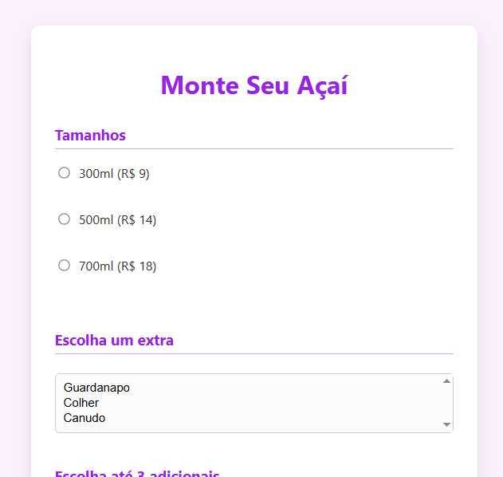

<h1 align="center"> Formulário de pedido </h1>

Programa para modelagem de um formulário de pedido.  

  <a href="#-tecnologias">Tecnologias</a>&nbsp;&nbsp;&nbsp;|&nbsp;&nbsp;&nbsp;
  <a href="#-projeto">Projeto</a>

 

  

## 🚀 Tecnologias

Esse projeto foi desenvolvido com as seguintes tecnologias:

- HTML e CSS
- PHP
- Git e Github

## 💻 Projeto

O Formulário de pedido é um modelo de formulário pronto baseado em php sem armazenamento.

---

By Giovanna Camargo.
